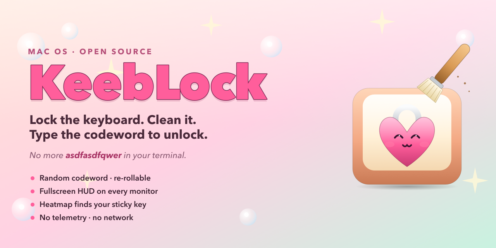
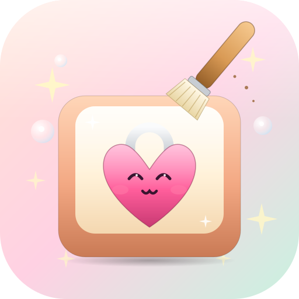
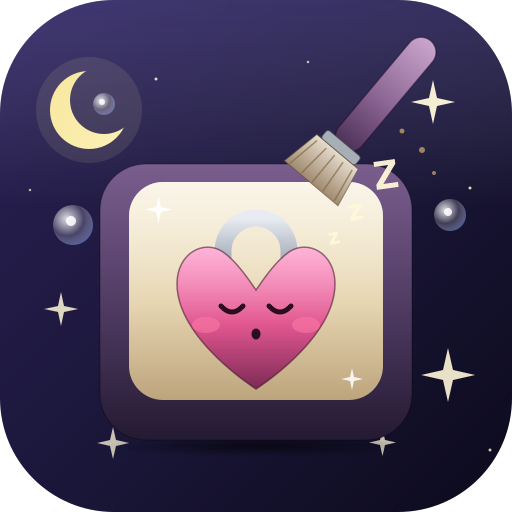
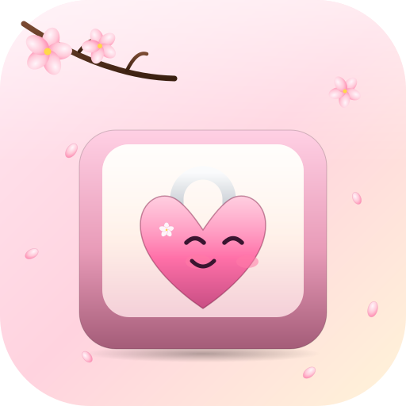
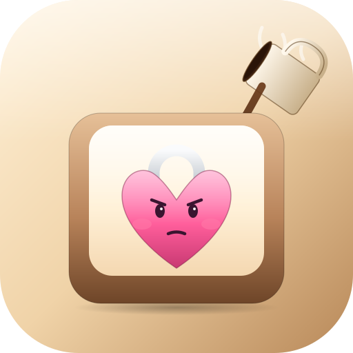
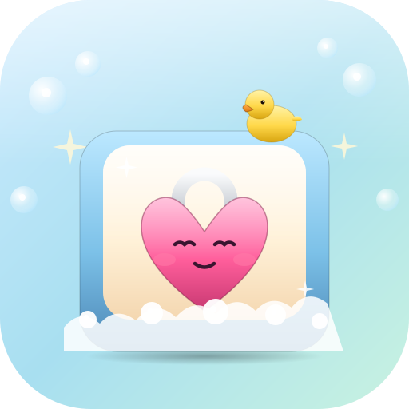

<p align="center">
  
</p>

<h1 align="center">KeebLock</h1>

<p align="center">
  <em>Lock the keyboard. Clean it. Type the codeword to unlock.</em>
</p>

<p align="center">
  <a href="https://github.com/bmmmm/KeebLock/releases/latest">
    
  </a>
  <a href="LICENSE">
    
  </a>
  
  
</p>

A small macOS utility that swallows every keystroke until you type a short
randomly-chosen codeword — so you can wipe the keys, dust the chassis, or
swap a switch without overwriting your terminal with `asdfasdfqwer`. The lock
covers every monitor, ignores Mission Control / Space-swipes, and survives
Magic Mouse fingertip-static while staying fully reversible: type the codeword,
or hit ⌘⌥Esc, and your machine is exactly where you left it.

## Why

Cleaning a plugged-in keyboard means dragged windows, trashed text fields,
accidental Cmd-Q, and the occasional fullscreen toggle from a stray F-key.
KeebLock takes the keyboard offline without unplugging it: it installs a
global event tap, displays a borderless lock surface on every screen, swallows
mouse / scroll / gesture input, and only releases when you type the chosen
codeword on a clean key (or when the optional auto-unlock timer expires).

## Features

- **Random codeword to unlock** — re-rollable, visible on screen, drawn from
  103 hand-curated single-word entries (mostly geology / minerals) with
  Wikipedia summaries and "Did you know?" trivia rotated at every 30 keystrokes.
- **Multi-display covered, including fullscreen Spaces** — uses both
  `.canJoinAllSpaces` and the private CGS API (`CGSAddWindowsToSpaces`,
  `CGSManagedDisplaySetCurrentSpace`) so a display parked on another app's
  fullscreen Space gets pulled to a regular Desktop for the lock and
  symmetrically restored on unlock. Resolved via `dlsym` so a future macOS
  symbol change degrades to the public flag instead of crashing.
- **Five accent themes** — Day, Sleepy, Sakura, Coffee, Bath. Tints launcher,
  HUD codeword progress, settings group headers, and ships matching app-icon
  variants for each theme.
- **Five screen effects** — sparks, rain, matrix, bubbles, snow — each on a
  Metal shader path, intensity slider, optional sound.
- **App zoom** — ⌘+ / ⌘− / ⌘0 scales the window 0.8× → 1.6× without giving up
  pixel-perfect controls (no dynamic-type scaling fallout).
- **Heatmap** — per-session and cumulative hit counts per physical keycode,
  rendered with the active keyboard-layout's actual labels (UCKeyTranslate).
- **Cleaning history** — every session is recorded with duration, keystroke
  count, and pixel-wipe stage reached.
- **Time-boxed lock (opt-in)** — pick a duration in Settings; the lock can
  auto-release when the timer hits zero. Off by default — codeword is the
  primary exit.
- **Build authenticity** — launcher footer surfaces the running binary's
  Apple Team ID + CDHash, with a one-click "I've verified" toggle that turns
  the shield green only when the published values match.
- **Self-rotating diagnostic log** — `~/Library/Logs/KeebLock/keeblock.log`
  rotates once it crosses a configurable size cap (1–100 MB, default 5 MB).
- **Keyboard-layout aware** — translates physical keycodes through the active
  input source for the heatmap; Greek / Cyrillic / etc. fall back to US-ANSI
  positions so codeword matching always works by key location.
- **No telemetry, no PII, no network** — everything stays on your Mac. The
  event tap reads keystrokes purely to count and swallow them.

## App icon — five flavours, one per theme

<p align="center">
  
  
  
  
  
</p>

The Asset Catalog ships all five tinted variants; the active accent theme
also recolours the SwiftUI surfaces (shortcut badges, codeword card, HUD
codeword progress, settings group headers).

## Requirements

- macOS 26 or newer (deployment target).
- Apple Silicon or Intel Mac with Metal-capable GPU (any Mac from 2014+).
- Accessibility permission — required to install the global `CGEventTap`
  that swallows keystrokes. KeebLock asks for it on first run and the
  launcher banner clears the moment you grant it in System Settings.

## Install

### Pre-built binary (recommended)

1. Grab the latest `KeebLock-x.y.z.zip` from the
   [Releases page](https://github.com/bmmmm/KeebLock/releases/latest)
   and unzip — you get `KeebLock.app`.
2. Move it into `/Applications`.
3. The app is signed with a Personal Team certificate (no Apple Developer
   ID notarisation), so Gatekeeper refuses to launch it on first try. Clear
   the macOS quarantine flag once:

   ```sh
   xattr -dr com.apple.quarantine /Applications/KeebLock.app
   ```

   Then right-click → **Open** → **Open** to confirm. Subsequent launches
   work normally.
4. Grant Accessibility permission when KeebLock asks (System Settings →
   Privacy & Security → Accessibility).

#### Verify the build

Each release publishes the Apple Team ID and CDHash that the build was
signed with. The launcher footer shows the same pair from the running
binary. To confirm in Terminal:

```sh
codesign -dv --verbose=4 /Applications/KeebLock.app 2>&1 \
  | grep -E '^(TeamIdentifier|CDHash)='
```

`TeamIdentifier` is constant across every official KeebLock release —
forging it requires the original signing certificate. `CDHash` is unique
to each build. Click the orange shield in the launcher, compare with the
release notes, then mark verified to turn it green.

### From source

```sh
git clone https://github.com/bmmmm/KeebLock.git
cd KeebLock
scripts/build.sh        # Debug build, errors / warnings filtered
scripts/install.sh      # copies KeebLock.app into /Applications
```

## First run

1. Open **KeebLock** from `/Applications`.
2. The launcher shows an orange *Accessibility permission required* banner.
   Click **Open System Settings**.
3. In *Privacy & Security → Accessibility*, enable **KeebLock**.
4. Switch back to KeebLock — the banner clears within a second.
5. Press the big button (or hit **Return**) to start the lock.

## Usage

| Shortcut         | Action                                    |
|------------------|-------------------------------------------|
| `⌘S` / `Return`  | Start lock                                |
| `⌘R`             | Roll a new random codeword                |
| `⌘,`             | Open Settings tab                         |
| `⌘+` / `⌘−`      | Zoom the launcher / settings UI           |
| `⌘0`             | Reset zoom to 100 %                       |
| `⌘Q`             | Quit KeebLock                             |
| **Codeword**     | …type it on a clean key to unlock         |
| `⌘⌥Esc`          | macOS force-quit (always-available exit)  |

There is intentionally **no Stop Cleaning shortcut**: the only way out of
an active session is the codeword (or the macOS force-quit panel). A
one-click stop would defeat the whole point of the app.

While locked, the HUD shows codeword progress, per-session keystroke
breakdown (letters / numbers / symbols / control / function / media keys,
mouse buttons, scroll, swipes, pinch, rotate), and a Wikipedia-derived
"Did you know?" card for the current codeword.

## Privacy

- **No network requests.** The codeword data and images ship in the bundle.
- The event tap reads key events to count and swallow them — they are
  **not logged, not stored, not exfiltrated**.
- The heatmap stores aggregate hit counts per *physical key code*, not the
  characters you typed.
- Logs in `~/Library/Logs/KeebLock/` are purely diagnostic; the codeword
  itself is never written, only its character count.
- Per-session counters live in memory; the cumulative heatmap and cleaning
  history are persisted to UserDefaults under the app's bundle id and
  scoped to your user account.
- `scripts/uninstall.sh` removes the app, all UserDefaults entries, and
  `~/Library/Logs/KeebLock/`. The Accessibility entry in *System Settings*
  must be removed manually — macOS does not let apps revoke their own
  TCC entries.

## Known limitations

Two inherent macOS behaviours that KeebLock cannot fix at the app layer.
Neither ever traps you — `⌘⌥Esc` reaches the system directly in both cases.

- **Secure-input bypass.** If another process holds secure event input
  (typically a focused password field) when the lock arms, keyboard events
  never reach a session-level event tap: keystrokes are neither swallowed
  nor counted toward the codeword until focus leaves the secure field. If
  the lock seems keyboard-inert right after starting, click away from any
  password prompt.
- **Tap-timeout leak.** If the app's main thread stalls long enough for
  the WindowServer watchdog to disable the event tap
  (`kCGEventTapDisabledByTimeout`), keystrokes during that brief window
  pass through to the focused app before the tap re-enables — exactly the
  input the lock exists to swallow. The hot path is kept fast and the tap
  re-enables immediately to minimise the window, but it cannot be
  eliminated.

## Codeword data

103 single-word entries grouped by theme (predominantly minerals and
geological formations). Each entry carries:

- A canonical title (e.g. "Granite", "Peridotite").
- A 2–3 sentence Wikipedia summary.
- A small set of factoids and a derived "Did you know?" snippet rotation.
- A landscape Wikimedia Commons image, license-checked and resized.
- The original image's licence + author + URL, gathered into
  [`KeebLock/Resources/CodewordImages/CREDITS.md`](KeebLock/Resources/CodewordImages/CREDITS.md).

To regenerate the dataset (Wikipedia REST → bundle resource):

```sh
scripts/fetch_codeword_data.py     # incremental; --force rebuilds
scripts/build_dyk.py               # offline DYK fallback (or LLM externally)
scripts/build_credits.py           # render CREDITS.md from attribution
```

The shipped `codeword_data.json` was hand-tuned per word; the scripts are
the regeneration path, not the canonical source.

## Build from source

```sh
scripts/build.sh             # Debug build (filtered output)
scripts/build.sh full        # full xcodebuild log
scripts/build.sh release     # Release configuration
scripts/build.sh analyze     # Clang static analyzer
scripts/build.sh clean       # wipe build/DerivedData
```

Versions are derived from git: `MARKETING_VERSION` from the latest tag,
`CFBundleVersion` from `git rev-list --count HEAD`. A build phase patches
the generated `Info.plist` so even a plain Xcode ⌘B picks up the right
version without touching `pbxproj`.

Code-signing uses `Automatic` + your Personal Team (free Apple Developer
account). Open the project in Xcode once and pick your team under
*Target → Signing & Capabilities* if the build complains about signing.

App Sandbox is **off** — required for `CGEventTap` global hooks. Hardened
Runtime is on.

## Releasing

```sh
scripts/release.sh 0.2.0
```

What it does:

1. Tags `v0.2.0`, pushes to Forgejo (the GitHub mirror auto-syncs).
2. Builds Release with the version pinned to that tag.
3. Packages `KeebLock.app` into `KeebLock-0.2.0.zip` (`ditto` preserves
   codesign + xattrs).
4. Captures Team ID + CDHash from `codesign -dv` and embeds them in the
   release notes alongside the SHA-256 of the zip.
5. Publishes the release on Forgejo via `tea`. Forgejo's push-mirror
   propagates tag + asset to GitHub within minutes.

Pass `--notes "..."` to override the default install / authenticity block.

## Uninstall

```sh
scripts/uninstall.sh
```

Removes the app, its UserDefaults blob, and `~/Library/Logs/KeebLock/`.
Revoke Accessibility manually in *System Settings → Privacy & Security*.

## License

- **Code** — [Apache License 2.0](LICENSE).
- **Codeword images** in `KeebLock/Resources/CodewordImages/` retain
  their original Wikimedia / Wikipedia licences; per-image attribution
  is documented in
  [`CREDITS.md`](KeebLock/Resources/CodewordImages/CREDITS.md). 63 of
  the 103 are share-alike — redistribution must include the credits file.
- **App icon family + banner** — © bmmmm, all rights reserved.

## Acknowledgements

- Wikipedia / Wikimedia Commons contributors for every codeword summary
  and image.
- The reverse-engineered CGS APIs (`CGSAddWindowsToSpaces`,
  `CGSManagedDisplaySetCurrentSpace`) ride on a decade of work by the
  yabai / Hammerspoon / Stay communities.

## Support

If KeebLock saved you from a bowl of crumbs, you can buy me a coffee:
[ko-fi.com/bmabma](https://ko-fi.com/bmabma).
